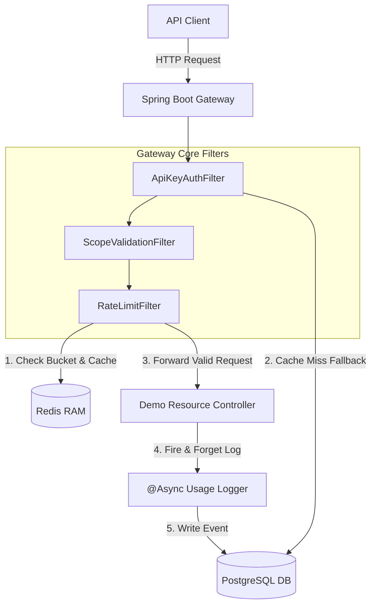
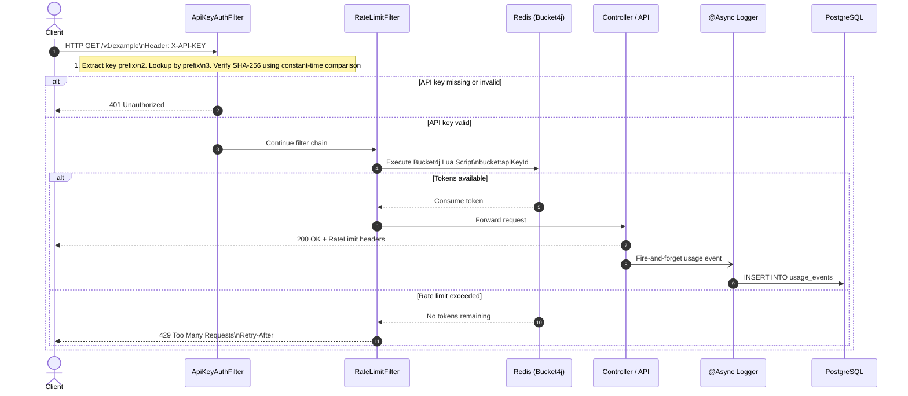
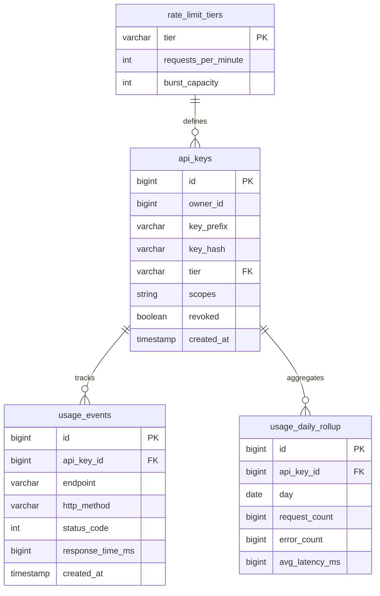

# API Gateway Architecture & Request Flow

## 1. High-Level Architecture Diagram

---

## 2. Request Flow Sequence Diagram

---

## 3. Database Entity Relationship Diagram (ERD)

---

## Database Notes

### `api_keys`

| Column | Description |
|---------|-------------|
| `id` | Primary key |
| `owner_id` | User who owns the API key |
| `key_prefix` | Short searchable prefix used for fast lookup (indexed) |
| `key_hash` | SHA-256 hash of the API key |
| `tier` | Foreign key to `rate_limit_tiers` |
| `scopes` | Allowed permissions (e.g. `read`, `write`) |
| `revoked` | Whether the key is disabled |
| `created_at` | Creation timestamp |

### `rate_limit_tiers`

| Column | Description |
|---------|-------------|
| `tier` | Tier name (`STARTER`, `PRO`, `ENTERPRISE`) |
| `requests_per_minute` | Sustained rate limit |
| `burst_capacity` | Maximum bucket capacity |

### `usage_events`

Stores every API request for analytics and auditing.

| Column | Description |
|---------|-------------|
| `api_key_id` | API key used |
| `endpoint` | Requested endpoint |
| `http_method` | GET, POST, etc. |
| `status_code` | HTTP response code |
| `response_time_ms` | Processing latency |
| `created_at` | Event timestamp |

### `usage_daily_rollup`

Stores aggregated daily usage statistics.

| Column | Description |
|---------|-------------|
| `api_key_id` | API key |
| `day` | Aggregation date |
| `request_count` | Total requests |
| `error_count` | Number of failed requests |
| `avg_latency_ms` | Average response time |
