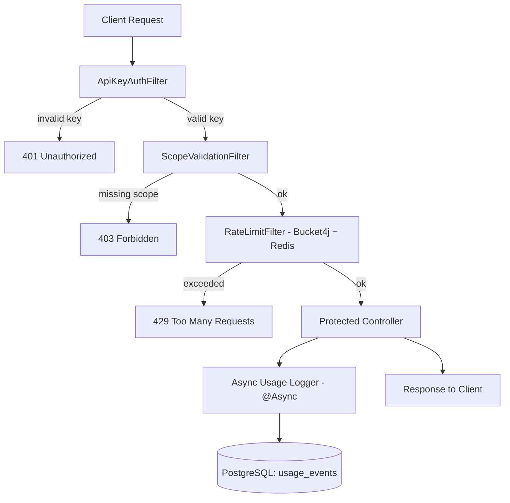
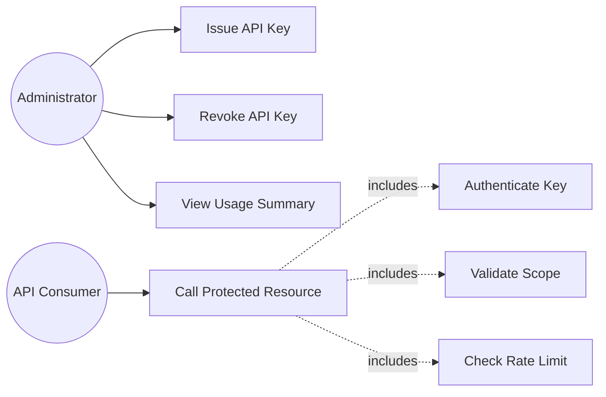
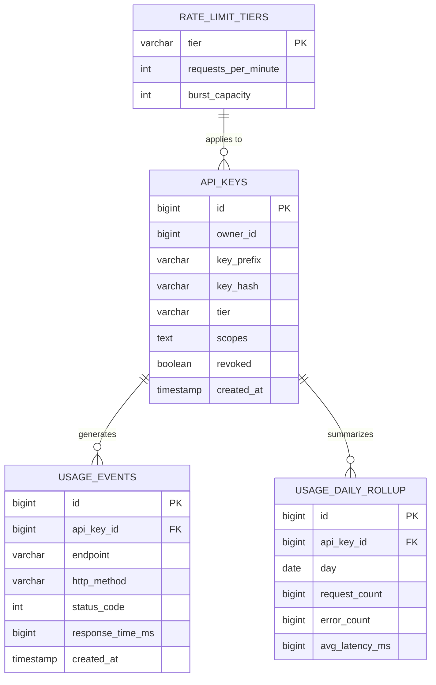
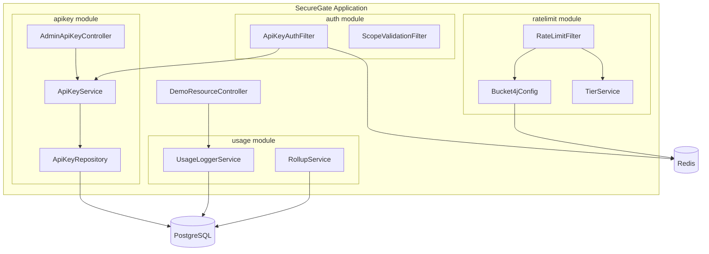
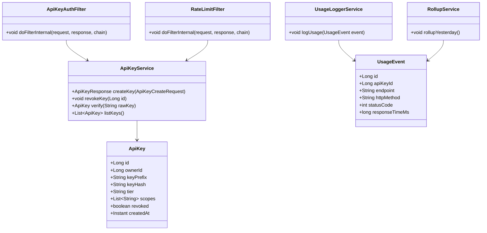
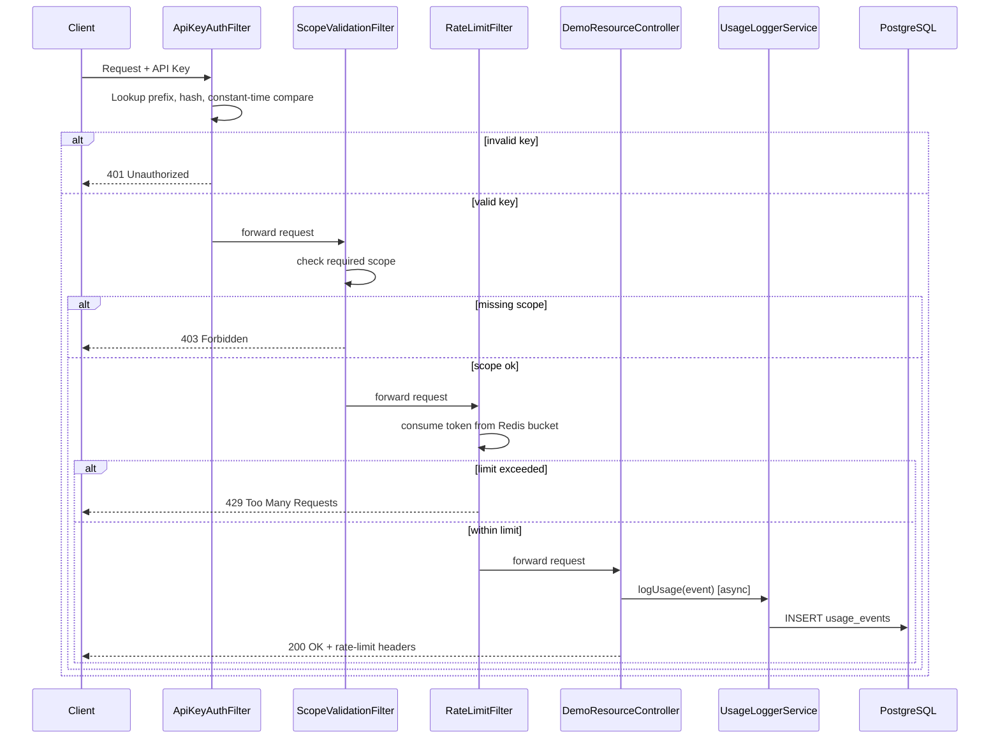
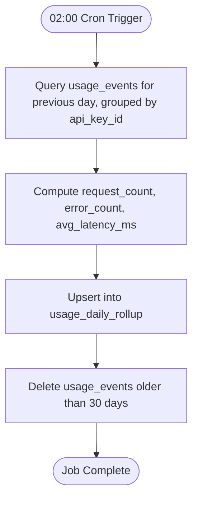

# Software Requirements Specification (SRS)
## SecureGate: A Multi-Tenant API Gateway with Distributed Rate Limiting and Secure API-Key Authentication

*IEEE 830-inspired structure*

---

## 1. Introduction

### 1.1 Purpose
This document specifies the functional and non-functional requirements for **SecureGate**, a Spring Boot–based multi-tenant API gateway providing API-key authentication, scope-based authorization, distributed rate limiting, and asynchronous usage analytics. It is intended for use by the project developer(s), academic evaluators, and project guide.

### 1.2 Scope
SecureGate authenticates API consumers via hashed API keys, authorizes their requests via scopes, enforces per-tenant rate limits using a Redis-backed token bucket, logs usage asynchronously, and aggregates that usage into daily rollups. It is delivered as a Dockerized Spring Boot 3 application backed by PostgreSQL (persistent storage) and Redis (rate-limit state and metadata cache). It does not include a front-end dashboard, a full OAuth2/JWT identity provider, or a distributed message broker.

### 1.3 Definitions
| Term | Definition |
|---|---|
| API Key | A secret token issued to a tenant to authenticate their API requests. |
| Scope | A named permission (e.g., `read`, `write`) attached to an API key. |
| Tier | A subscription level (e.g., STARTER, PRO) that determines rate-limit thresholds. |
| Token Bucket | A rate-limiting algorithm where requests consume tokens from a refilling bucket. |
| Rollup | A daily aggregation of raw usage events into summary statistics. |

### 1.4 Acronyms
| Acronym | Meaning |
|---|---|
| AuthN | Authentication |
| AuthZ | Authorization |
| SRS | Software Requirements Specification |
| TTL | Time To Live |
| JWT | JSON Web Token |
| ORM | Object-Relational Mapping |

### 1.5 References
- Bucket4j documentation (token-bucket rate limiting library for Java)
- Spring Framework reference documentation (`@Async`, `@Scheduled`, Spring Security)
- PostgreSQL and Redis official documentation
- Project scoping notes (source document, Section "Multi-Tenant API Gateway")

### 1.6 Overview
Section 2 describes the product at a high level. Section 3 details functional requirements per module. Section 4 covers non-functional requirements. Section 5 defines use cases. Section 6 covers database design. Section 7 covers system design diagrams. Sections 8–10 cover UI requirements, external interfaces, and testing.

---

## 2. Overall Description

### 2.1 Product Perspective
SecureGate is a standalone gateway component deployed in front of one demonstration protected resource endpoint. It is self-contained (not integrated into a larger existing system) but is architected the way a reusable gateway layer for any backend service would be.

### 2.2 Product Functions
- API key issuance and revocation (administrator only).
- API key authentication (hash + prefix lookup + constant-time comparison).
- Scope-based authorization.
- Distributed, tier-based rate limiting with standard rate-limit response headers.
- Asynchronous usage-event logging.
- Redis metadata caching with revoke-triggered eviction.
- Scheduled daily usage rollup and raw-data retention pruning.
- Automated testing suite (unit, integration, load).

### 2.3 User Classes

| User Class | Role | Responsibilities | Permissions |
|---|---|---|---|
| **Administrator** | Manages tenant API keys | Create keys, revoke keys, list keys, view usage summaries | Full access to `/admin/**` endpoints via HTTP Basic Auth |
| **API Consumer (Tenant)** | Uses the protected API | Sends requests using an assigned API key within scope and rate limits | Access limited to endpoints matching the scopes on their key |

### 2.4 Operating Environment
| Category | Detail |
|---|---|
| Hardware | Standard developer laptop/desktop (minimum 8 GB RAM recommended for running Docker containers) |
| Backend Runtime | Java 17+ (Spring Boot 3) |
| Database | PostgreSQL 16 |
| Cache / Rate-Limit Store | Redis 7 |
| Containerization | Docker & Docker Compose |
| API Testing | Postman / cURL |
| Load Testing | k6 |
| Version Control | Git (GitHub) |

### 2.5 Assumptions
- Redis and PostgreSQL are run as containers alongside the application via Docker Compose for demonstration purposes.
- The demonstration environment is single-host; the design is horizontally-scalable in principle (Redis as shared state) but is not evaluated on a multi-host cluster.
- Administrator authentication uses HTTP Basic Auth over HTTPS in a production-equivalent setting; for local academic demonstration, HTTP is acceptable.

---

## 3. Functional Requirements

### FR-1: API Key Issuance
- **Module Name:** AdminApiKeyController — Create Key
- **Description:** Allows an authenticated administrator to generate a new API key for a tenant.
- **Inputs:** Owner/tenant ID, requested tier, list of scopes.
- **Outputs:** HTTP 201 with the raw API key (returned only once) and key metadata.
- **Processing:** Generate a cryptographically random key using `SecureRandom`, compute its SHA-256 hash and 8-character prefix, persist the hash/prefix/tier/scopes, and return the raw key to the caller.
- **Preconditions:** Caller is authenticated as Administrator.
- **Postconditions:** A new row exists in `api_keys`; the raw key is never persisted or logged.

### FR-2: API Key Revocation
- **Module Name:** AdminApiKeyController — Revoke Key
- **Description:** Allows an administrator to revoke an existing API key.
- **Inputs:** Key ID.
- **Outputs:** HTTP 204 No Content.
- **Processing:** Mark the key as `revoked = true` in the database and evict the corresponding entry from the Redis metadata cache.
- **Preconditions:** Key ID exists.
- **Postconditions:** The key immediately fails authentication on subsequent requests.

### FR-3: API Key Listing
- **Module Name:** AdminApiKeyController — List Keys
- **Description:** Returns a list of issued API keys (excluding hashes) for administrative review.
- **Inputs:** None (optional pagination parameters).
- **Outputs:** HTTP 200 with a list of key metadata objects.
- **Processing:** Query all `api_keys` rows, excluding the `key_hash` field from the response.
- **Preconditions:** Caller is authenticated as Administrator.
- **Postconditions:** None (read-only).

### FR-4: API Key Authentication
- **Module Name:** ApiKeyAuthFilter
- **Description:** Authenticates every inbound request to protected endpoints using the presented API key.
- **Inputs:** API key from a request header.
- **Outputs:** Request proceeds to the next filter, or HTTP 401 is returned.
- **Processing:** Extract the key prefix, look up the corresponding record (via Redis cache, falling back to PostgreSQL), hash the presented key, and compare it to the stored hash using `MessageDigest.isEqual()` for constant-time comparison.
- **Preconditions:** Request targets a protected endpoint.
- **Postconditions:** Authenticated tenant context is attached to the request for downstream filters.

### FR-5: Scope Validation
- **Module Name:** ScopeValidationFilter
- **Description:** Verifies that the authenticated key's scopes include the permission required by the requested endpoint.
- **Inputs:** Authenticated key's scope list; endpoint's required scope.
- **Outputs:** Request proceeds, or HTTP 403 is returned.
- **Processing:** Compare the required scope against the key's granted scopes.
- **Preconditions:** Request has already passed API key authentication.
- **Postconditions:** None (read-only check).

### FR-6: Rate Limiting
- **Module Name:** RateLimitFilter
- **Description:** Enforces a per-tenant, per-tier request-rate ceiling.
- **Inputs:** Authenticated tenant's tier; current bucket state in Redis.
- **Outputs:** Request proceeds with rate-limit headers set, or HTTP 429 with `Retry-After` is returned.
- **Processing:** Attempt to consume one token from the tenant's Redis-backed Bucket4j bucket, configured with the tier's requests-per-minute and burst capacity.
- **Preconditions:** Request has passed authentication and scope validation.
- **Postconditions:** Bucket state in Redis is updated; response headers reflect remaining capacity.

### FR-7: Asynchronous Usage Logging
- **Module Name:** UsageLoggerService
- **Description:** Records each processed request as a usage event without blocking the response.
- **Inputs:** API key ID, endpoint, HTTP method, status code, response time.
- **Outputs:** A persisted row in `usage_events`.
- **Processing:** Submit a `@Async`-annotated logging task to a dedicated thread pool (`core=4, max=8, queue=500`, `CallerRunsPolicy` for backpressure).
- **Preconditions:** A request has completed processing.
- **Postconditions:** A `usage_events` row exists (eventually consistent with respect to the response).

### FR-8: Daily Usage Rollup
- **Module Name:** RollupScheduler / RollupService
- **Description:** Aggregates the previous day's raw usage events into a summary table and prunes old raw data.
- **Inputs:** None (triggered by cron schedule).
- **Outputs:** Upserted rows in `usage_daily_rollup`; deletion of `usage_events` older than 30 days.
- **Processing:** Runs daily at 02:00 via Spring's `@Scheduled`, grouping by `api_key_id` to compute request count, error count, and average latency.
- **Preconditions:** None.
- **Postconditions:** `usage_daily_rollup` reflects the previous day's aggregated statistics.

### FR-9: Redis Metadata Cache
- **Module Name:** ApiKeyService — Cache Layer
- **Description:** Caches key metadata (hash, tier, scopes, revoked flag) in Redis to reduce database load on the authentication hot path.
- **Inputs:** Key prefix.
- **Outputs:** Cached metadata object, with a 60-second TTL.
- **Processing:** On cache miss, load from PostgreSQL and populate the cache; on revocation, explicitly delete the cache entry rather than waiting for TTL expiry.
- **Preconditions:** None.
- **Postconditions:** Cache is consistent with the database within, at worst, the TTL window (except on explicit revoke, which is immediate).

### FR-10: Usage Summary Retrieval
- **Module Name:** AdminApiKeyController — Usage Summary
- **Description:** Allows an administrator to view rollup statistics for a given key.
- **Inputs:** Key ID.
- **Outputs:** HTTP 200 with daily rollup records for that key.
- **Processing:** Query `usage_daily_rollup` filtered by `api_key_id`.
- **Preconditions:** Caller is authenticated as Administrator; key ID exists.
- **Postconditions:** None (read-only).

---

## 4. Non-Functional Requirements

| Category | Requirement |
|---|---|
| **Performance** | The authentication + rate-limit filter chain should add no more than a few milliseconds of overhead per request under normal load, verified via k6. |
| **Reliability** | Asynchronous logging failures must not affect the client-facing response; the executor's `CallerRunsPolicy` provides graceful backpressure rather than silent data loss under load. |
| **Availability** | The system should remain available for authentication and rate limiting as long as Redis and PostgreSQL are reachable; the design explicitly favors Redis as the single source of truth for rate-limit state to avoid clock-skew issues across instances. |
| **Security** | API keys are never stored or logged in plaintext; all comparisons of secret values use constant-time comparison to prevent timing attacks; admin endpoints require authentication. |
| **Maintainability** | Code is organized into clearly separated modules (`apikey`, `auth`, `ratelimit`, `usage`, `demo`, `common`) to keep concerns isolated and testable. |
| **Scalability** | Rate-limit state is held in Redis (not local memory) specifically so that multiple application instances can share limits consistently. |
| **Portability** | The entire stack (application, PostgreSQL, Redis) is defined via Docker Compose for portable, reproducible deployment. |
| **Usability** | Administrative operations are exposed via a small, consistent REST API; error responses follow a consistent JSON structure via a global exception handler. |
| **Backup** | Raw usage events older than 30 days are pruned after rollup to keep the operational table small; rollup data is retained as the durable historical record. |
| **Data Privacy** | Only prefixes and hashes of API keys are stored; the `client_ip` column was deliberately excluded from `usage_events` as an unused/unnecessary data point. |

---

## 5. Use Cases

### UC-1: Issue API Key
- **Actor:** Administrator
- **Description:** Administrator creates a new API key for a tenant.
- **Preconditions:** Administrator is authenticated.
- **Main Flow:** Admin submits owner ID, tier, and scopes → system generates and hashes a key → system persists the record → system returns the raw key once.
- **Alternate Flow:** If required fields are missing, the system returns a 400 validation error.
- **Postconditions:** A new active API key exists.

### UC-2: Revoke API Key
- **Actor:** Administrator
- **Description:** Administrator revokes a compromised or unused key.
- **Preconditions:** Key exists and is active.
- **Main Flow:** Admin submits key ID → system marks it revoked → system evicts the Redis cache entry.
- **Alternate Flow:** If the key ID does not exist, the system returns a 404.
- **Postconditions:** The key is immediately rejected on the next authentication attempt.

### UC-3: Call Protected Resource
- **Actor:** API Consumer (Tenant)
- **Description:** A tenant calls a protected demo endpoint using their API key.
- **Preconditions:** Tenant holds a valid, non-revoked API key.
- **Main Flow:** Tenant sends request with API key → key is authenticated → scope is validated → rate limit is checked → controller processes request → usage is logged asynchronously → response is returned.
- **Alternate Flow:** If the key is invalid → 401; if scope is missing → 403; if rate limit is exceeded → 429.
- **Postconditions:** A usage event is recorded for the request.

### UC-4: View Usage Summary
- **Actor:** Administrator
- **Description:** Administrator reviews aggregated usage statistics for a tenant's key.
- **Preconditions:** Rollup job has run at least once for the relevant period.
- **Main Flow:** Admin requests summary for a key ID → system returns daily rollup rows.
- **Alternate Flow:** If no rollup data exists yet, the system returns an empty list.
- **Postconditions:** None (read-only).

---

## 6. Database Design

### 6.1 Entities

| Entity | Description | Primary Key | Foreign Key(s) |
|---|---|---|---|
| `api_keys` | Stores issued API keys and their metadata | `id` | — |
| `rate_limit_tiers` | Defines rate-limit thresholds per tier | `tier` | — |
| `usage_events` | Raw log of individual API calls | `id` | `api_key_id → api_keys.id` |
| `usage_daily_rollup` | Aggregated daily statistics per key | `id` | `api_key_id → api_keys.id` |

### 6.2 Data Dictionary

**api_keys**
| Column | Type | Constraints |
|---|---|---|
| id | BIGSERIAL | PRIMARY KEY |
| owner_id | BIGINT | NOT NULL |
| key_prefix | VARCHAR(12) | NOT NULL, UNIQUE INDEX |
| key_hash | VARCHAR(64) | NOT NULL |
| tier | VARCHAR(30) | NOT NULL, DEFAULT 'STARTER' |
| scopes | TEXT[] | NOT NULL |
| revoked | BOOLEAN | NOT NULL, DEFAULT FALSE |
| created_at | TIMESTAMP | NOT NULL, DEFAULT now() |

**rate_limit_tiers**
| Column | Type | Constraints |
|---|---|---|
| tier | VARCHAR(30) | PRIMARY KEY |
| requests_per_minute | INT | NOT NULL |
| burst_capacity | INT | NOT NULL |

**usage_events**
| Column | Type | Constraints |
|---|---|---|
| id | BIGSERIAL | PRIMARY KEY |
| api_key_id | BIGINT | NOT NULL, REFERENCES api_keys(id) |
| endpoint | VARCHAR(255) | NOT NULL |
| http_method | VARCHAR(10) | NOT NULL |
| status_code | INT | NOT NULL |
| response_time_ms | BIGINT | NOT NULL |
| created_at | TIMESTAMP | NOT NULL, DEFAULT now() |

**usage_daily_rollup**
| Column | Type | Constraints |
|---|---|---|
| id | BIGSERIAL | PRIMARY KEY |
| api_key_id | BIGINT | NOT NULL, REFERENCES api_keys(id) |
| day | DATE | NOT NULL |
| request_count | BIGINT | NOT NULL |
| error_count | BIGINT | NOT NULL |
| avg_latency_ms | BIGINT | NOT NULL |
| — | — | UNIQUE(api_key_id, day) |

### 6.3 ER Diagram

---

## 7. System Design

### 7.1 System Architecture Diagram
*(see Section 2.1 for the primary request-flow architecture diagram)*

### 7.2 Component Diagram

### 7.3 Class Diagram

### 7.4 Sequence Diagram — Authenticated Request

### 7.5 Activity Diagram — Nightly Rollup Job

---

## 8. User Interface Requirements

SecureGate is an API-only backend service; there is no graphical front end. The primary "interface" is the REST API itself, documented and explorable via **Swagger UI** at `/swagger-ui.html` (stretch goal). API responses follow consistent JSON structures for success and error cases via a global exception handler, ensuring a predictable "interface" for any client (Postman, cURL, or an external application).

---

## 9. External Interfaces

### 9.1 Software Interfaces
- **Spring Boot 3** application runtime (Java 17+).
- **Spring Security** for filter-chain integration and HTTP Basic Auth on admin endpoints.
- **Bucket4j** library for token-bucket rate-limiting logic.

### 9.2 Database Interfaces
- **PostgreSQL 16** accessed via Spring Data JPA for `api_keys`, `usage_events`, `usage_daily_rollup`, and `rate_limit_tiers`.
- **Redis 7** accessed via `bucket4j-redis` for rate-limit bucket state and via Spring Data Redis for the key-metadata cache.

### 9.3 APIs

| Endpoint | Method | Auth | Notes |
|---|---|---|---|
| `/admin/api-keys` | POST | Basic (admin) | Creates a key; returns raw key once, HTTP 201 |
| `/admin/api-keys/{id}` | DELETE | Basic (admin) | Revokes key, evicts cache, HTTP 204 |
| `/admin/api-keys` | GET | Basic (admin) | Lists keys (no hash returned), HTTP 200 |
| `/admin/usage/{apiKeyId}` | GET | Basic (admin) | Returns rollup summary, HTTP 200 |
| `/v1/example-resource` | GET | API Key + scope `read` | Demo protected endpoint |

**Error Responses:** `401` (invalid/missing key), `403` (missing scope), `429` (rate-limited, with `Retry-After` and `X-RateLimit-Remaining`), `500` (generic server error).

---

## 10. Testing

### 10.1 Testing Strategy Overview

| Type | Tool | Covers |
|---|---|---|
| Unit | JUnit 5 + Mockito | Hash/verify logic, constant-time compare, scope check, bucket configuration |
| Integration | Testcontainers (PostgreSQL + Redis) | Full filter chain, revoke → immediate 401, Redis bucket sharing across requests |
| Security | MockMvc | 401/403/429 response paths, tampered-key rejection |
| Load | k6 | Confirms 429 on limit breach, refill after window, tenant isolation of quotas |

### 10.2 Sample Test Cases

| ID | Test Type | Description | Input | Expected Output |
|---|---|---|---|---|
| TC-01 | Unit | Verify SHA-256 hash of a known key matches expected digest | Fixed raw key | Hash equals expected value |
| TC-02 | Unit | Constant-time comparison returns true for matching hashes | Two identical hashes | `true` |
| TC-03 | Unit | Constant-time comparison returns false for mismatched hashes | Two different hashes | `false` |
| TC-04 | Unit | Scope check passes when required scope is present | Key with `["read","write"]`, required `read` | Authorization granted |
| TC-05 | Unit | Scope check fails when required scope is absent | Key with `["write"]`, required `read` | 403 Forbidden |
| TC-06 | Integration | Valid key authenticates successfully against demo endpoint | Valid API key | 200 OK |
| TC-07 | Integration | Revoked key is rejected immediately after revocation | Revoke key, then call endpoint | 401 Unauthorized |
| TC-08 | Integration | Two requests from the same key share a Redis-backed bucket across instances | Two sequential requests, low limit | Second request within same window is throttled if over capacity |
| TC-09 | System | Admin creates and then lists a key | POST then GET `/admin/api-keys` | Created key appears in list without hash field |
| TC-10 | System | Rate-limit headers are present on every authenticated response | Any valid request | `X-RateLimit-Limit`, `X-RateLimit-Remaining` headers present |
| TC-11 | Load (k6) | N+1 requests within a window exceed the bucket capacity | N = tier's requests-per-minute | Request N+1 returns 429 with `Retry-After` |
| TC-12 | Load (k6) | Two different tenants do not share a single quota | Concurrent traffic from two API keys | Neither tenant's requests affect the other's remaining quota |
| TC-13 | UAT | Administrator revokes a key and confirms it can no longer be used | Full revoke → call flow | Immediate 401 on next call |
| TC-14 | UAT | Administrator reviews a tenant's daily usage after the rollup job runs | GET `/admin/usage/{id}` after rollup | Non-empty rollup row for the previous day |
