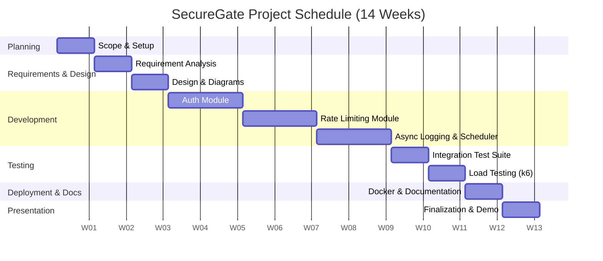

# Project Plan
## SecureGate: A Multi-Tenant API Gateway with Distributed Rate Limiting and Secure API-Key Authentication

---

## 1. Project Overview
SecureGate is a Spring Boot 3 backend service that provides secure, multi-tenant API-key authentication, scope-based authorization, distributed token-bucket rate limiting (Bucket4j + Redis), asynchronous usage logging to PostgreSQL, and a scheduled nightly usage-rollup job. The project is scoped to be fully achievable by a final-year student (or small student team) within a single academic semester, while remaining faithful to the design decisions used by production API platforms.

## 2. Objectives
- Deliver a working, containerized API gateway implementing the ten core features listed in the Software Requirements Specification.
- Demonstrate distributed-systems and application-security concepts through a working, tested implementation rather than a purely theoretical treatment.
- Produce a fully tested, documented, and demonstrable system suitable for academic evaluation and technical interview discussion.

## 3. Scope
This plan covers the full lifecycle of the SecureGate project: planning, requirement analysis, design, development, testing, documentation, deployment (via Docker Compose), and final presentation. Enterprise-scale add-ons (Kafka, multi-region Redis, observability stack, full JWT/OAuth2 admin identity, front-end dashboard) are explicitly excluded, consistent with the Problem Statement and SRS.

---

## 4. Project Methodology

**Chosen Methodology: Agile (Scrum-inspired, solo/small-team adaptation)**

### Justification
The project has a fixed, well-understood feature set but benefits from iterative delivery: each module (authentication, rate limiting, async logging, scheduling) can be built, tested, and demonstrated independently before integration. An Agile approach with short (weekly) iterations allows:
- Early, working increments (e.g., authentication working before rate limiting is added).
- Continuous integration testing (via Testcontainers) after each module, catching regressions early.
- Flexibility to adjust the stretch goal (Swagger documentation) based on remaining time, without jeopardizing the core deliverable.

A pure Waterfall approach was considered but rejected because the modules have natural incremental checkpoints (each is independently testable and demonstrable), which Agile's iteration structure exploits directly; Waterfall's single up-front design phase would delay integration risk discovery (e.g., Redis bucket-sharing behavior) until too late in the schedule.

---

## 5. Team Roles

*Note: The reference design was scoped for solo execution; the roles below are provided to satisfy a team-based academic submission format and may be consolidated if executed individually.*

| Role | Responsibilities |
|---|---|
| **Team Leader** | Coordinates the schedule, tracks milestone completion, liaises with the project guide, makes final architectural decisions (e.g., Bucket4j over hand-rolled limiter). |
| **Backend Developer(s)** | Implement the `apikey`, `auth`, `ratelimit`, `usage`, and `demo` modules; write unit tests alongside each module. |
| **Database Developer** | Designs and maintains the schema (`api_keys`, `usage_events`, `usage_daily_rollup`, `rate_limit_tiers`), writes migrations, and optimizes indexes (e.g., prefix index for fast key lookup). |
| **Tester / QA** | Writes and runs Testcontainers integration tests, MockMvc security tests, and the k6 load-test scripts; maintains the test-case matrix. |
| **Documentation / API Designer** | Maintains the README, architecture and sequence diagrams, and Swagger/OpenAPI documentation (stretch goal); since there is no front-end UI, this role substitutes for a UI Designer, focusing on the API's usability as its "interface." |

---

## 6. Work Breakdown Structure (WBS)

| Phase | Key Activities |
|---|---|
| **1. Planning** | Finalize scope (cut JWT/Quartz/RabbitMQ/dashboard), define milestones, set up repository and project board |
| **2. Requirement Analysis** | Derive functional/non-functional requirements, define use cases, finalize database schema |
| **3. Design** | Architecture diagram, ER diagram, class/sequence/activity diagrams, folder structure, API contract |
| **4. Development** | Build `apikey`, `auth`, `ratelimit`, `usage`, `demo`, and `common` modules incrementally |
| **5. Testing** | Unit tests, Testcontainers integration suite, MockMvc security tests, k6 load tests |
| **6. Documentation** | README, architecture write-up, Data Dictionary, this SRS/Problem Statement/Project Plan set |
| **7. Deployment** | Dockerfile, Docker Compose stack, environment configuration |
| **8. Presentation** | Demo video/live demo, resume/portfolio summary, mock Q&A preparation |

---

## 7. Milestones

| Milestone | Description | Duration | Expected Deliverable |
|---|---|---|---|
| M1: Project Kickoff | Scope finalized, repository initialized, tooling set up | Week 1 | Approved Problem Statement, initialized Git repo |
| M2: Requirements & Design Sign-off | SRS and all design diagrams completed and reviewed | Weeks 2–3 | Approved SRS with ER, class, sequence, use-case diagrams |
| M3: Authentication Core Complete | Key generation, hashing, `ApiKeyAuthFilter`, admin CRUD endpoints | Weeks 4–5 | Working authentication module with unit + integration tests |
| M4: Rate Limiting Complete | Bucket4j + Redis integration, rate-limit headers, metadata cache | Weeks 6–8 | Working rate-limiting module with integration tests |
| M5: Async Logging & Scheduling Complete | `@Async` usage logger, `@Scheduled` rollup job | Weeks 9–10 | Usage logging + rollup module with tests |
| M6: Full Test Suite & Load Test | Complete Testcontainers suite, k6 load-test scripts and results | Weeks 11–12 | Passing test suite; k6 report showing 429 enforcement |
| M7: Deployment & Documentation | Docker Compose stack, README, all diagrams finalized | Week 13 | Runnable `docker compose up` demo; complete documentation set |
| M8: Final Presentation | Demo recording/live demo, Q&A preparation | Week 14 | Final presentation and submission package |

---

## 8. Project Schedule

*Note: The original source scoping compresses this work into an aggressive 3–4 week solo "portfolio sprint." For academic submission, the same technical phases have been spread across a standard 14-week semester schedule to allow for review cycles, iterative testing, and formal documentation — this is stated explicitly as an assumption (see Problem Statement, Section 10).*

| Week | Activities |
|---|---|
| 1 | Scope finalization, tooling setup, repository initialization, Problem Statement draft |
| 2 | Requirement analysis, use-case definition, database schema draft |
| 3 | Architecture, ER, class, and sequence diagrams; SRS finalization |
| 4 | Entity setup, Flyway migrations, `ApiKeyService` (generate/hash/verify) + unit tests |
| 5 | `ApiKeyAuthFilter`, scope validation, admin CRUD endpoints, Basic Auth config, integration tests |
| 6 | Redis setup, Bucket4j configuration, `RateLimitFilter`, tier lookup service |
| 7 | Rate-limit response headers, 429 handling, edge-case tests |
| 8 | Redis metadata cache, revoke-triggered eviction, integration tests |
| 9 | `UsageEvent` entity, `@Async` logger, executor tuning |
| 10 | `@Scheduled` rollup job and rollup unit tests |
| 11 | Full Testcontainers integration suite |
| 12 | k6 load-test scripts, load-test execution and result analysis |
| 13 | Docker Compose, Dockerfile, README, diagram finalization, Swagger (if time permits) |
| 14 | Bug fixes, code cleanup, demo recording, final documentation review, presentation prep |

### Gantt Chart

---

## 9. Resources Required

| Category | Resource |
|---|---|
| Hardware | Developer laptop/desktop, 8 GB+ RAM (for running Docker containers) |
| Programming Language | Java 17+ |
| Framework | Spring Boot 3 (Spring Web, Spring Security, Spring Data JPA, Spring Data Redis) |
| Database | PostgreSQL 16 |
| Cache / Rate-Limit Store | Redis 7 |
| Rate-Limiting Library | Bucket4j (with `bucket4j-redis`) |
| IDE | IntelliJ IDEA / VS Code |
| Containerization | Docker, Docker Compose |
| Testing Tools | JUnit 5, Mockito, Testcontainers, k6 |
| API Documentation | Springdoc OpenAPI / Swagger UI (stretch goal) |
| Version Control | Git, GitHub |
| Migration Tool | Flyway |

---

## 10. Risk Analysis

| Risk | Probability | Impact | Mitigation Strategy |
|---|---|---|---|
| Scope creep (re-adding JWT/Quartz/RabbitMQ) | Medium | High | Explicit "Cut" list maintained (Section 4 of SRS reference material); scope reviewed at each milestone |
| Redis bucket-sharing bugs across concurrent requests | Medium | High | Dedicated integration tests (Testcontainers) specifically targeting concurrent bucket consumption |
| Timing-attack vulnerability from incorrect hash comparison | Low | High | Use `MessageDigest.isEqual()` exclusively; unit test explicitly verifying constant-time behavior |
| Cache staleness after key revocation | Medium | Medium | Explicit cache eviction on revoke, in addition to TTL, verified by integration test (TC-07) |
| Underestimating async executor tuning / queue overflow | Low | Medium | Use `CallerRunsPolicy` for graceful backpressure; document behavior under saturation |
| Time overrun on stretch goals (Swagger) | Medium | Low | Marked explicitly as stretch, scheduled only after core suite passes (Week 13+) |
| Team member unavailability (if executed as a team) | Low | Medium | Cross-training on modules via code review; documentation kept current throughout |
| Docker/environment setup issues before demo | Low | Medium | Docker Compose tested well before final week; environment documented in README |

---

## 11. Cost Estimate

*All tools and infrastructure used are free/open-source; the estimate below reflects notional effort cost for academic reporting purposes, not actual cash expenditure.*

| Item | Estimated Cost (₹) | Notes |
|---|---|---|
| Development tools (IDE, Docker Desktop) | 0 | Free/community editions |
| Database (PostgreSQL) | 0 | Open-source, self-hosted via Docker |
| Cache (Redis) | 0 | Open-source, self-hosted via Docker |
| Cloud hosting (for demo, optional) | 0–1,500 | Optional free-tier cloud VM if live deployment is desired |
| Domain name (optional, for public demo) | 0–800/year | Only if a public demo URL is desired |
| Miscellaneous (printing, binding of report) | 500–1,000 | Standard academic submission costs |
| **Total (minimum, local-only demo)** | **≈ ₹500–1,000** | |
| **Total (with optional cloud demo)** | **≈ ₹1,500–3,300** | |

---

## 12. Quality Assurance

### 12.1 Coding Standards
- Consistent package structure by module (`apikey`, `auth`, `ratelimit`, `usage`, `demo`, `common`), as defined in the SRS.
- No secret values (raw API keys) are ever logged or persisted — enforced via code review checklist.
- Constant-time comparison mandated for all secret comparisons (`MessageDigest.isEqual()`, never `String.equals()`).

### 12.2 Testing Process
- Unit tests written alongside each module (JUnit 5 + Mockito).
- Integration tests run against real PostgreSQL and Redis instances via Testcontainers, not mocks, to validate true cross-service behavior (e.g., Redis bucket sharing).
- Load testing via k6 performed before the deployment milestone to validate rate-limit correctness under concurrent, multi-tenant traffic.

### 12.3 Documentation Review
- README, architecture diagrams, and ER diagram reviewed at Milestone M7 for accuracy against the final implementation.
- This three-document set (Problem Statement, SRS, Project Plan) cross-checked for consistency of feature scope, terminology, and schema.

### 12.4 Version Control
- Git used throughout, with an incremental, feature-scoped commit history (e.g., "add SHA-256 hashing + tests," "implement RateLimitFilter," "add cache eviction on revoke") to maintain a clear, reviewable development trail.
- Feature work integrated frequently to avoid large, hard-to-review merges.

---

## 13. Deployment Plan

### 13.1 Installation
The application, PostgreSQL, and Redis are packaged as services in a single `docker-compose.yml`. Installation consists of cloning the repository and running `docker compose up`.

### 13.2 Configuration
Environment-specific values (database credentials, Redis connection details, rate-limit tier defaults) are externalized via Spring Boot configuration properties / environment variables, avoiding hard-coded secrets in source control.

### 13.3 Testing (Post-Deployment)
After deployment, a smoke test is performed: create an API key via the admin endpoint, call the protected demo endpoint successfully, exceed the rate limit to confirm a 429 response, then revoke the key and confirm an immediate 401.

### 13.4 User Training
Since SecureGate is an API-only product, "training" consists of API documentation (README and, where completed, Swagger UI) describing authentication headers, scopes, and error codes for any developer integrating against the gateway.

---

## 14. Maintenance Plan

| Type | Description |
|---|---|
| **Corrective Maintenance** | Fixing defects discovered post-deployment, such as edge cases in rate-limit boundary handling or cache-eviction timing, identified via the automated test suite or manual QA. |
| **Adaptive Maintenance** | Adjusting the system to environment changes, such as newer Spring Boot, Bucket4j, or PostgreSQL/Redis versions, or extending tier definitions as new subscription levels are introduced. |
| **Perfective Maintenance** | Enhancements beyond the current scope that could be pursued in future iterations, such as adding the previously descoped Swagger documentation, per-endpoint (rather than per-tenant) rate limits, or a lightweight analytics dashboard — explicitly out of scope for this submission but noted as natural extensions. |
